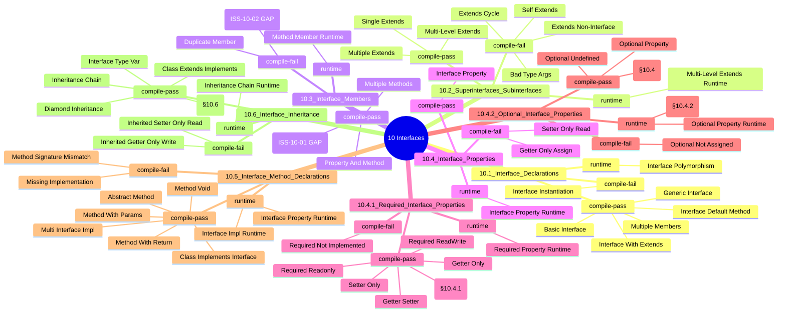

# 10 Interfaces - Test Design Mindmap

```mermaid
mindmap
  root((10 Interfaces))
    10.1_Interface_Declarations
      compile-pass
        Basic Interface
        Generic Interface
        Interface With Extends
        Multiple Members
        Interface Default Method
      compile-fail
        Interface Instantiation
      runtime
        Interface Polymorphism
    10.2_Superinterfaces_Subinterfaces
      compile-pass
        Single Extends
        Multiple Extends
        Multi-Level Extends
      compile-fail
        Extends Non-Interface
        Extends Cycle
        Self Extends
        Bad Type Args
      runtime
        Multi-Level Extends Runtime
    10.3_Interface_Members
      compile-pass
        Property And Method
        Multiple Methods
        Object Method Clash (ISS-10-01 GAP)
      compile-fail
        Duplicate Member
        Object Method Clash Return (ISS-10-02 GAP)
      runtime
        Method Member Runtime
    10.4_Interface_Properties
      compile-pass
        Interface Property
      compile-fail
        Getter Only Assign
        Setter Only Read
      runtime
        Interface Property Runtime
    10.4.1_Required_Interface_Properties
      compile-pass
        Required Readonly
        Required ReadWrite
        Getter Setter
        Getter Only
        Setter Only
        Field Accessor Equivalence (§10.4.1)
      compile-fail
        Required Not Implemented
      runtime
        Required Property Runtime
    10.4.2_Optional_Interface_Properties
      compile-pass
        Optional Property
        Optional Undefined
        Optional Property Equivalence (§10.4)
      compile-fail
        Optional Not Assigned
      runtime
        Optional Property Runtime
        Optional Property Default Setter (§10.4.2)
    10.5_Interface_Method_Declarations
      compile-pass
        Abstract Method
        Method With Params
        Method With Return
        Method Void
        Class Implements Interface
        Multi Interface Impl
      compile-fail
        Missing Implementation
        Method Signature Mismatch
      runtime
        Interface Impl Runtime
        Interface Property Runtime
    10.6_Interface_Inheritance
      compile-pass
        Inheritance Chain
        Diamond Inheritance
        Interface Type Var
        Class Extends Implements
        Property Inheritance (§10.6)
      compile-fail
        Inherited Getter Only Write
        Inherited Setter Only Read
      runtime
        Inheritance Chain Runtime
```
